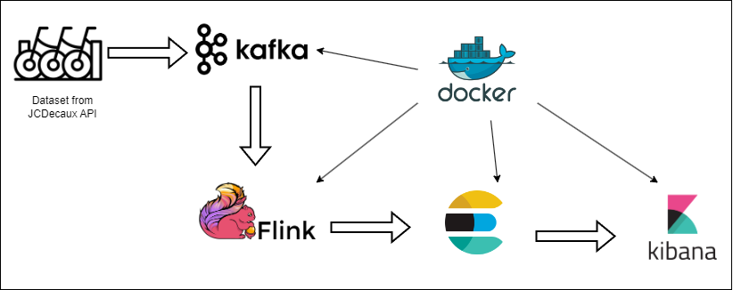
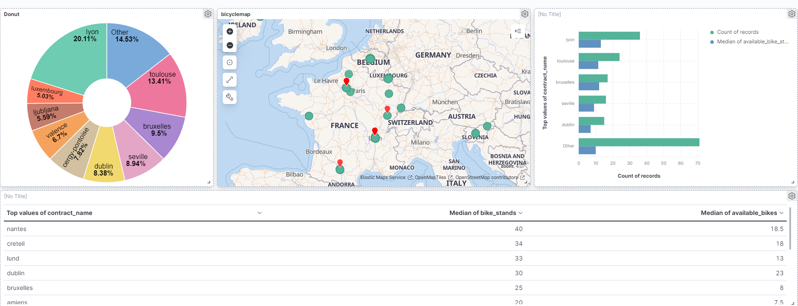

<h1 align="center">
  <br>
  Continuous bicycle tracking in real-time. 
</h1>

<div align="center">
  <h4>
    <a href="#Context">Context</a> |
    <a href="#Technologies-and-Architecture">Technologies and Architecture</a> |
    <a href="#Running-the-Application">Running the Application</a> |
    <a href="#Live-Demo">Live Demo</a> |
    

  </h4>
</div>
<br>


## Context 

In Europe, bicycle stations are strategically located at various points, each equipped with a designated bike capacity. It is crucial to monitor these stations in real-time to promptly identify instances when a station becomes empty. Taking proactive measures is essential to ensure user satisfaction, as users seeking bicycles expect to find stations adequately stocked when they wish to utilize the service. This project aims to achieve real-time visualizations by retrieving data from the JCDecaux API and presenting it in a dynamic dashboard.

### JCDecaux API Documentation

To retrieve real-time data on bicycle stations, this project utilizes the JCDecaux API. You can find detailed information and documentation on the API by visiting the [JCDecaux API Documentation](https://developer.jcdecaux.com/).

**Note:** Before using the JCDecaux API, make sure to obtain your API key from JCDecaux. You can register for an API key on their [developer portal](https://developer.jcdecaux.com/).

The JCDecaux API allows you to access information about bike stations, available bikes, and more, enabling dynamic and up-to-date visualizations in the project's dashboard.

## Technologies and Architecture
Below is an architecture diagram illustrating the flow of data and the integration of technologies in this project:



**Description:**
1. **Data Ingestion:**
   - Kafka (Version 3.3) is used to request real-time data from the JCDecaux API and produce it to a Kafka topic named 'bike.'

2. **Data Processing:**
   - PyFlink (Version 1.16.3) consumes data from the Kafka topic, processes it, and generates meaningful insights.

3. **Data Storage:**
   - Elasticsearch (Version 7.17) stores the processed data in an index named 'bike.'

4. **Visualization:**
   - Kibana is integrated with Elasticsearch for dynamic visualization of the processed data.

This Dockerized architecture ensures seamless deployment and scalability, allowing for easy setup and management of all components in a containerized environment.

## Running the Application
### Running the Application

1. **Prerequisites:**
     - Ensure you have Docker installed on your machine.
     - Obtain the necessary API key from JCDecaux for data retrieval.

2. **Clone the Repository:**
     ```bash
     git clone https://github.com/Soulaimene/Bicycle-Station-Flink-Real-Time.git
     cd Bicycle-Station-Flink-Real-Time
     ```
3. **Build Docker Images and Run the Application:**
     ```bash
     docker-compose build
     docker-compose up -d
     ```
Now all the required technologies are set up in Docker containers, eliminating the need for manual installation on your local machine.

4. **Create Elasticsearch Index:**
  - Run the following command to create the Elasticsearch index:
    ```
    python elasticsearch_index.py
    ```

5. **Run the Kafka Producer:**
  - Start the Kafka producer to fetch data from JCDecaux API:
    ```
    python kafka_producer.py --api_key 'your-jcdecaux-api-key'
    ```
6. **Start PyFlink Consumer:**
   - Run the following command to start the PyFlink consumer and process data from Kafka, sinking it to Elasticsearch:
     ```
     docker-compose exec jobmanager ./bin/flink run -py /opt/pyflink-kafka-stream/fl.py -d
     ```
7. **Access Kibana Dashboard:**
  - Open your browser and go to `http://localhost:5601` to access the Kibana dashboard.
  - All visualizations are preconfigured and will load automatically.
  
8. **Stop the Application:**
  - To stop the application and free up resources, run:
    ```
    docker-compose down
    ```
